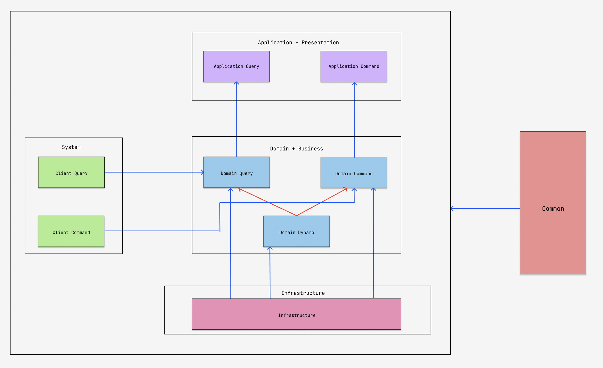

# Withmarket-main-server

이 프로젝트는 WithMarket의 **가게와 관련된 서비스**를 담당하는 스프링 기반의 프로젝트입니다.

현재는 **아키텍처의 확장** 에 집중하고 있으며, 요구사항이 모두 정해질 시 기능 구현을 할 에정입니다.

* * *

### 👉 본 프로젝트의 목적

본 프로젝트는 졸업작품을 위한 것 뿐만 아니라 본인의 실력 향상에도 목적을 두고있다.

따라서 본 프로젝트의 구현에 있어서 우선순위는 다음과 같다.

1️⃣ 확장에 유연한 아키텍처 설계 능력 향상

2️⃣ 역할과 책임이 명확하게 분리되어있는 설계

3️⃣ 신기술에 대해서 트레이드오프를 따지며 기술선정을 하는 능력

4️⃣ 기능 구현

* * *

### 👉 프로젝트 참여자 (Contributors of this project)
1️⃣ Doyeop Kim (18k7102dy@naver.com)

* * *

### 👉 사용되는 기술 스택 (Tech used in this project)

1️⃣ **사용 언어**

2️⃣ **프로젝트 아키텍처**

* Multi-Module Architecture (멀티모듈 기반의 설계)
* CQRS Architecture (Command-Query Responsibility Segregation)

3️⃣ **개발 방법론**

* DDD (Domain Driven Development)

4️⃣ **사용된 데이터베이스**

 

5️⃣ **사용된 프레임워크**

  

6️⃣ **사용된 라이브러리**

  

7️⃣ **빌드 툴**

8️⃣ **Test Libraries**

 

9️⃣ **Container Tool**

* * *

### 👉 **모듈 분리에 관한 의사결정 과정**

저는 모듈의 분리에 관한 목적은 **코드의 역할과 책임에 따른 명확한 분리**에 있다고 생각합니다. 따라서 저는 **역할과 책임**을 분리하는 기준을 명확하게 할 필요가 있다고 보았습니다.

따라서 저는 3단계의 필터를 두어서 System에 관여하는 모듈을 4개 정도로 나누고자 하였습니다.

* * *

### 👉 **본 프로젝트 모듈 구조 (Architecture of this project)**

이 섹션에서는 본 프로젝트의 모듈에 대해서 설명하고자한다. 프로젝트 모듈을 분리하면서 주의해야할 점을 먼저 소개한 다음에, 본격적으로 본 프로젝트의 아키텍처를 설명하고자한다.

1️⃣ 분리한 module 간에는 Bi-Directional Dependency (Dependency Cycle)이 발생하지 않도록 주의하자. 쌍방 의존이 안좋은것도 맞고, 그냥 gradle에서 빌드 자체가 안된다.

2️⃣ 분리한 module 간에는 Common 모듈이 아닌 이상 2단계 아래 참조는 웬만하면 금지한다. 2단게 아래 참조를 한다는건 모듈 분리가 잘못됐다는 증거다. (Infrastructure layer는 제외)

이제부터 본격적으로 프로젝트의 아키텍처에 대해서 설명하겠다.

1. **Application Layer**

응용계층, 표현 계층을 관리하는 모듈. 즉, Handler, Router class 들을 관리하는 모듈이다.

* Application-query: 조회 로직을 관리하는 application module
* Application-command: 커맨드 로직을 관리하는 application module

2. **System Layer**

어플리케이션 로직을 모르고, 도메인 로직을 모르지만, System에는 관여하는 코드들을 모아둔 모듈이다. 주로 DTO가 여기에 위치한다.

* client-query: 조회 DTO를 모아둔 모듈
* client-command: 명령 로직에 사용되는 DTO를 모아둔 모듈

3. **Domain Layer**

Entity, Service, Repository, Validator를 구현하는 Layer.

* domain-dynamo: dynamo에 관련된 도메인을 관리하는 모듈. Entity, Repository, Validator를 보관하며, Repository에 대해서는 실제 구현체가 아닌 interface만을 보관한다.
* domain-query: query 로직에 대한 Service를 구현하는 모듈
* domain-command: command 로직에 대한 Service를 구현하는 모듈

4. **Infrastructure**

domain layer에 존재하는 repository에 대해서 실제 구현체를 보관하는 모듈이다. DB에 접근하기 위한 config, RepositoryImpl을 여기서 구현해서 Bean으로 등록한다.

5. **Common**

System에는 관여하지 않지만, System을 구현함에 있어서 필요한 타입을 정의하는 모듈이다.

**System에 관여하지 않는 타입클래스 혹은 툴만 여기다 위치시켜서 common hell에 빠지지 않도록 항상 주의하자.**